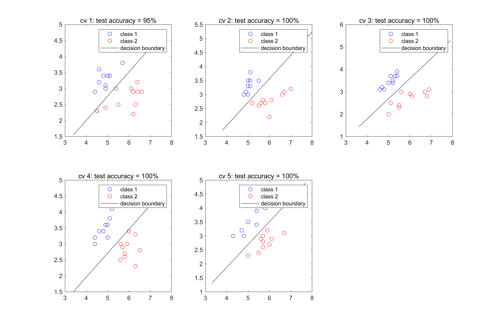

# Demo_LDA<br>
Implemenatation of Linear Discriminant Analysis  in MATLAB using Fisher's Iris data

# Example of the results
The code generating the following figures is found in phase_diff_probability.py.



# Requirements<br>
&ensp; Operation has been confirmed only under the following environment. <br>
&ensp;&ensp; - OS: Microsoft Windows 10 Pro Version 10.0 (Build 19043) <br>
&ensp;&ensp; - MATLAB 9.11.0.1769968 (R2021b) <br>
&ensp;&ensp; - Java 1.8.0_202-b08 with Oracle Corporation Java HotSpot(TM) 64-Bit <br>
&ensp;&ensp; - Optimization Toolbox  <br>
&ensp;&ensp; - Signal Processing Toolbox <br>
&ensp;&ensp; - Statistics and Machine Learning Toolbox <br>
&ensp;&ensp; - Parallel Computing Toolbox <br>
&ensp; <br>
&ensp; The implemented scripts are not guaranteed to run on any other version in MATLAB than the above.<br>
&ensp; <br>

# Authors<br>
&ensp; Hiroshi Yokoyama<br>
&ensp;&ensp;(Division of Neural Dynamics, Department of System Neuroscience, National Institute for Physiological Sciences, Japan)<br>

# Cite<br>
Please cite my GitHub repository if you use this code in your own work:

```
@software{Demo_LDA,
  author = {Yokoyana H.},
  title = {Demo_LDA},
  url = {https://github.com/myGit-YokoyamaHiroshi/Demo_LDA},
  year = {2021}
}
```
